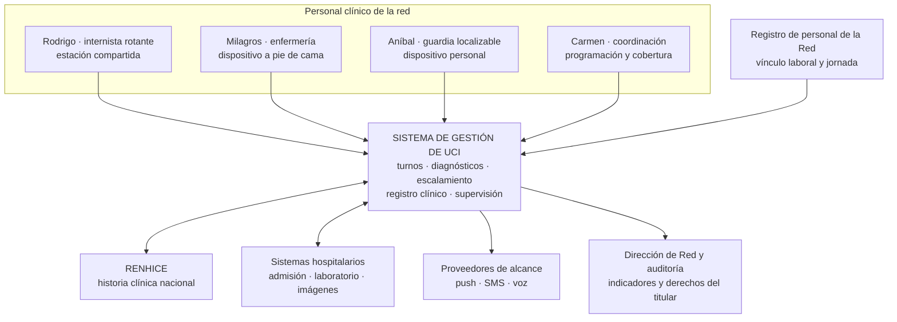
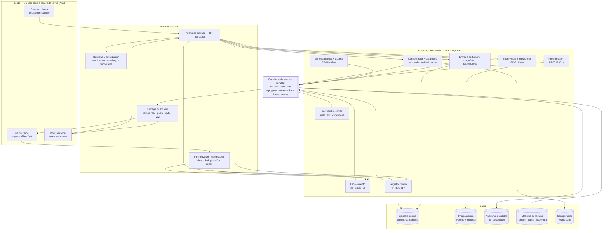
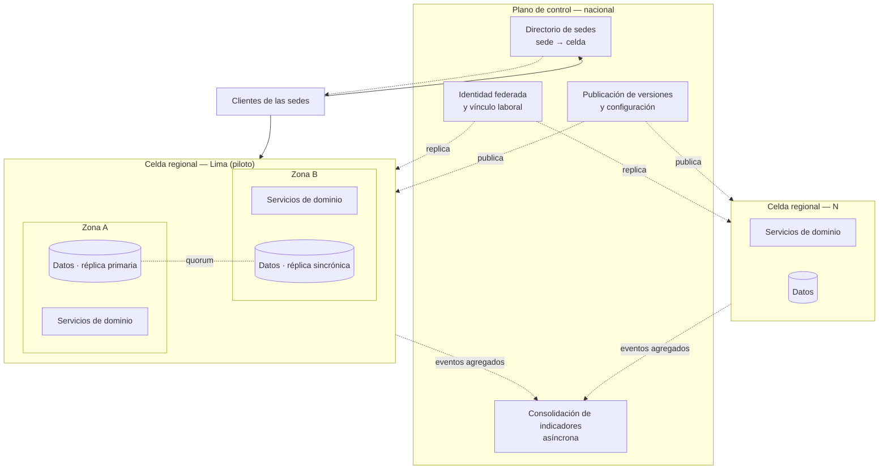
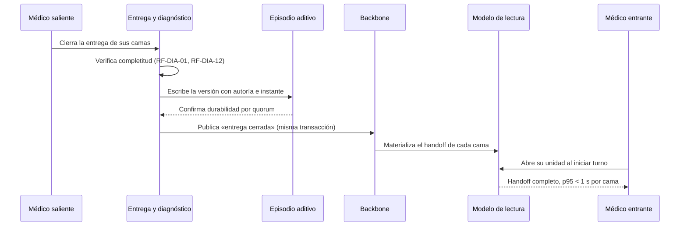
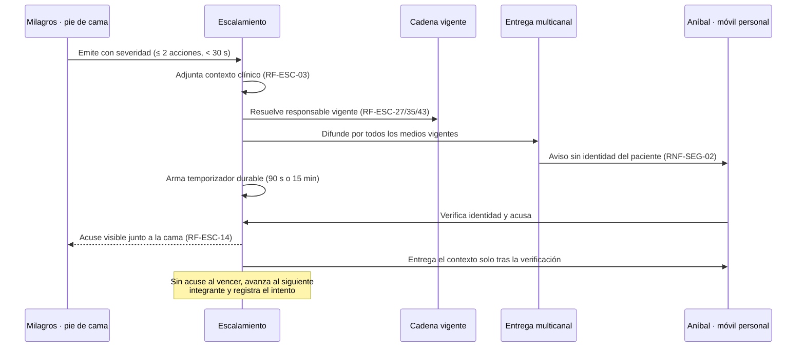
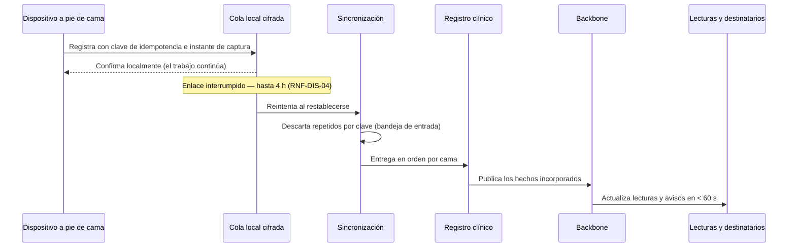

# Arquitectura de la solución

Sistema de Gestión de UCI — Essalud · Piloto Lima y sus distritos, con proyección nacional

> **Qué afirma este documento.** Cómo se estructura el sistema para sostener el comportamiento que
> [`Requirements/ReqFunc.MD`](../Requirements/ReqFunc.MD) exige y las medidas que
> [`Requirements/ReqNoFunc.MD`](../Requirements/ReqNoFunc.MD) fija. Es el dueño de la decisión técnica
> que [`CONVENCIONES.md`](CONVENCIONES.md), sección 1, desplaza fuera de los requerimientos: «ningún RF
> ni RNF nombra un mecanismo, un producto ni una topología; la decisión técnica desplazada se registra
> en `docs/`, no se suprime».
>
> **Qué no afirma.** No introduce comportamiento nuevo: si una decisión de aquí exige una garantía que
> ningún RF enuncia, el defecto está en el requerimiento y se corrige allí, no aquí. No sustituye a
> `ReqNoFunc.MD` como dueño de los umbrales; los cita.

Vocabulario: [`GLOSARIO.md`](GLOSARIO.md). Decisiones de dominio ya cerradas:
[`DECISIONES-ITERACION-2.md`](DECISIONES-ITERACION-2.md). Vista visual de apoyo:
[`arquitectura-solucion.excalidraw`](arquitectura-solucion.excalidraw).

---

## 1. Los requerimientos que moldean la estructura

De 194 RF y 26 RNF, solo un subconjunto es **arquitectónicamente significativo**: aquel que, si se
ignora, obliga a rehacer la estructura y no a corregir un módulo. El resto se satisface dentro de los
componentes que estos imponen.

| # | Driver | Origen | Qué fuerza en la estructura | Dificultad |
|---|---|---|---|:---:|
| A1 | Handoff disponible en p95 < 1 s por cama, en la ventana de cambio de turno | `RNF-PER-04`, `RNF-PER-01`, P1 | Lectura precomputada en el momento del cierre, servida desde la región dueña de la sede; ninguna composición en el camino de lectura | Alta |
| A2 | Ningún diagnóstico confirmado se pierde ante la caída de un nodo | `RNF-DIS-03`, `RF-DIA-20` | Escritura durable con quorum antes de confirmar; registro aditivo, nunca sustitución en sitio | Alta |
| A3 | Escalamiento entregado en p95 < 15 s con acuse y avance a los 90 s | `RNF-PER-03`, P2 | Máquina de estados con temporizadores durables y difusión multicanal con proveedores reemplazables | Alta |
| A4 | Operación a pie de cama con hasta 4 h sin enlace, sin pérdida ni duplicación | `RNF-DIS-04`, `RF-REG-02`, `RF-ESC-21` | Cliente offline-first con cola cifrada e idempotencia extremo a extremo | Alta |
| A5 | 1 K → 100 K → 10 M unidades UCI federadas, 200 000 activas concurrentes | `RNF-ESC-01…03`, D-02 | Partición por red/sede y crecimiento por adición de celdas, sin estado global en el camino caliente | Alta |
| A6 | 99,9 % mensual y recuperación < 5 min sin personal en la sede | `RNF-DIS-01`, `RNF-DIS-02`, `RNF-OBS-01` | Redundancia multi-zona con conmutación automática; detección < 60 s; ningún procedimiento manual local | Alta |
| A7 | 100 % de accesos y cambios auditables, ninguna versión sustituible | `RNF-SEG-01`, `RNF-SEG-03`, `RF-IAM-03` | Bitácora inmutable derivada del propio registro de hechos, en almacenamiento no reescribible | Media |
| A8 | Aviso sin identidad del paciente y contexto solo tras verificación, en dispositivo no institucional | `RNF-SEG-02`, `RF-IAM-04`, `RF-IAM-05` | Separación entre canal de aviso y canal de contexto; nada clínico en la carga de la notificación | Media |
| A9 | Autoría y alcance del registro atados a quien responde por la cama en ese turno | `RF-IAM-01`, `RF-IAM-02`, `RF-ESC-27` | Autorización por atributos derivados de la programación vigente, no por rol estático | Media |
| A10 | Sede nueva operativa por configuración, sin detener las activas ni tocar código | `RNF-MAN-02`, `RNF-PER-02` | Multi-tenencia por datos: red, sede, unidad y cama son configuración | Media |
| A11 | Publicación de versión sin intervención equipo por equipo ni parada clínica | `RNF-MAN-01` | Cliente distribuible desde el servidor y contratos compatibles hacia atrás | Media |
| A12 | Intercambio con RENHICE conforme a un perfil versionado | `RNF-INT-01`, D-04 | Capa anticorrupción con el perfil y los catálogos como dato versionado | Media |
| A13 | Misma secuencia de operación clínica en toda la red | `RNF-USA-03` | Un solo cliente para toda la red; la variación entre sedes es configuración, no build | Baja |

Los tres problemas críticos del enunciado atraviesan estos drivers: **P1 rotación** se sostiene en
A1–A2, **P2 medianoche** en A3–A8, **P3 tiempo real** en A4 y A1.

---

## 2. Restricciones y supuestos

| # | Restricción | Fuente | Consecuencia estructural |
|---|---|---|---|
| R1 | Datos de salud son categoría sensible: consentimiento, cifrado y trazabilidad de acceso | Ley N.° 29733 | Cifrado en tránsito y en reposo; bitácora de accesos no eliminable; residencia de datos clínicos en territorio nacional |
| R2 | Interoperabilidad de la historia clínica electrónica | Ley N.° 30024, D-04 | Servicio de intercambio con perfil CorePE v0.1 (HL7 FHIR R4, IPS Perú) registrado por versión |
| R3 | El derecho de acceso del titular se responde en 20 días, ampliable una vez | D-03, `RNF-SEG-04` | Consulta por episodio y por titular sobre la bitácora, sin recorrer el sistema a mano |
| R4 | La programación y el registro conservados son la fuente oficial; lo imprimible es vista | D-05 | Ninguna ruta de escritura fuera del sistema; la exportación es de solo lectura |
| R5 | Personal clínico sin soporte de tecnología presente en la sede durante el turno noche | `RNF-DIS-02`, `RNF-OBS-01` | Ninguna recuperación puede depender de una acción en la sede |

**Supuestos declarados.** No se resuelven en silencio; se marcan como exige `CONVENCIONES.md`,
sección 2.

- `[SUPUESTO: la meta de 10 M se dimensiona como 10 millones de unidades UCI federadas registradas y
  200 000 activas en la ventana de cambio de turno, conforme a D-02. El sistema se estructura para que
  ese crecimiento sea adición de celdas y no reescritura; el piloto de Lima se despliega con una sola
  celda.]`
- `[SUPUESTO: la ventana de cambio de turno concentra la carga de lectura del día. El dimensionamiento
  toma esa ventana como pico y no el promedio diario.]`
- `[ACLARAR: qué entidad administrativa real corresponde a una unidad UCI federada en el catálogo de
  Essalud, para fijar la clave de partición definitiva.]`
- `[ACLARAR: si la infraestructura del piloto admite dos zonas de disponibilidad efectivamente
  independientes en Lima; de ello depende que RNF-DIS-02 se cumpla sin una segunda región.]`

---

## 3. Vista de contexto

Los cinco sistemas externos entran por una frontera explícita. Ninguno de ellos está en el camino
crítico de A1 ni de A3: si RENHICE, el laboratorio o el registro de personal no responden, la entrega
de turno y el escalamiento siguen operando con lo que el sistema ya conserva. La única dependencia
externa dentro de un umbral es la de los proveedores de alcance en A3, y por eso son reemplazables y
redundantes entre sí.

---

## 4. Estilo arquitectónico

**Celdas regionales autónomas**, cada una con sus servicios de dominio particionados por capacidad,
comunicadas por un **backbone de eventos durables**, con **lecturas precomputadas** separadas de las
escrituras y **clientes offline-first** en el borde.

Cuatro rasgos, y el driver que obliga a cada uno:

| Rasgo | Obliga | Qué se rompería sin él |
|---|---|---|
| Celda regional autónoma como unidad de despliegue, datos y falla | A5, A6 | Una falla o un pico de una región alcanzaría a toda la red; el crecimiento a 10 M exigiría reescribir el particionamiento |
| Servicios por capacidad de dominio (turnos, diagnóstico, escalamiento, registro, identidad, supervisión) | A3, A5, A11 | El escalamiento —que necesita temporizadores y difusión— compartiría ciclo de vida y presupuesto de falla con la programación mensual |
| Registro aditivo con lecturas precomputadas | A1, A2, A7 | El handoff compondría datos en tiempo de lectura y no sostendría p95 < 1 s; la auditoría sería un artefacto aparte, y por tanto discrepante |
| Borde offline-first con sincronización idempotente | A4, A13 | Una interrupción del enlace en la unidad detendría el registro a pie de cama, que es la operación de mayor volumen de escritura |

### Alternativas descartadas

| Alternativa | Por qué se descarta |
|---|---|
| Monolito modular único por región | Sostiene el piloto de 1 K, pero A5 y A6 exigen aislar el radio de falla y escalar por partes: el escalamiento tiene un perfil de carga y de disponibilidad que la programación mensual no tiene |
| Base de datos global única con réplicas de lectura | El camino caliente de A1 quedaría atado a la latencia entre regiones y el radio de falla sería la red entera; contradice A5 y A6 |
| Servidor por sede (nodo local en cada hospital) | Resolvería A4 con holgura, pero contradice R5, `RNF-MAN-01` y `RNF-MAN-02`: multiplica por sede el equipo que hay que operar, parchear y recuperar de noche sin personal presente. La degradación se resuelve en el cliente, donde ya hace falta por A4 |
| Notificación best-effort sin acuse durable | A3 exige reconstruir la cadena completa y avanzar por vencimiento de plazo; sin acuse durable no hay avance verificable ni auditoría de `RNF-OBS-02` |
| Consistencia fuerte global en toda escritura | Incompatible con A4 —el registro offline se confirma localmente— y con el presupuesto de latencia de A1 |

La consistencia se elige por dato, no de una vez: **fuerte dentro del agregado** —una entrega de
turno, una cadena de escalamiento, una programación vigente— y **eventual entre agregados y entre
celdas**, con el orden garantizado por agregado. Es lo que permite que `RF-TUR-01` (rechazo de cruce)
y `RF-DIA-01` (bloqueo de cierre) sean decisiones locales y verificables, mientras los indicadores de
red de `RF-SUP-02` se consolidan de forma asíncrona.

---

## 5. Vista de contenedores

### Qué hace cada servicio y por qué es un servicio

| Servicio | Responsabilidad | Por qué se separa |
|---|---|---|
| **Programación** (`RF-TUR`) | Programación vigente, cruces, jornada, permisos, intercambios, cobertura de franjas descubiertas | Es el único que decide sobre el tiempo del personal; concentra la regla de `RF-TUR-01` y `RF-TUR-02`, cuya verificación necesita ver todas las asignaciones del profesional en toda la red |
| **Entrega de turno y diagnóstico** (`RF-DIA`) | Entrega médica y de enfermería, bloqueo de cierre, versiones del diagnóstico, marcas de inestabilidad | Dueño del camino de A1; su lectura tiene el umbral más exigente y su escritura la garantía de durabilidad más estricta |
| **Escalamiento** (`RF-ESC`) | Cadena vigente, severidades, plazos, acuses, delegación, agotamiento | Perfil de carga y de falla propio: temporizadores durables, ráfagas y dependencia de terceros. Aislarlo evita que un incidente de difusión degrade la programación |
| **Registro clínico** (`RF-REG`) | Signos, eventos, medicación, indicaciones, resultados de estudios | Mayor volumen de escritura del sistema y única ruta que recibe tráfico diferido desde el borde |
| **Identidad clínica y autoría** (`RF-IAM`) | Verificación en el dispositivo, ámbito de escritura por cama y turno, medios de contacto, retención de registros sin identidad vigente | A9 exige derivar el permiso de la programación, no del rol; esa derivación es una decisión y necesita dueño |
| **Supervisión e indicadores** (`RF-SUP`) | Cumplimiento de entregas, cobertura de red, auditoría de escalamientos | Consulta analítica sobre periodos; su carga no debe competir con el camino clínico |
| **Configuración y catálogos** | Red, sede, unidad, cama, roles, cadenas, plazos y políticas | A10: incorporar una sede es escribir datos aquí, y nada más |
| **Intercambio clínico** | Traducción al perfil CorePE v0.1 y de vuelta, con la versión registrada | Capa anticorrupción: el cambio de un perfil externo no alcanza al modelo de dominio |

### Contratos entre servicios

- **Escritura:** síncrona y transaccional dentro del agregado. El servicio confirma solo cuando el
  hecho es durable (A2).
- **Propagación:** por evento en el backbone, publicado con la técnica de bandeja de salida —el hecho
  y su evento se escriben en la misma transacción—, de modo que no exista un hecho registrado cuyo
  evento se perdió.
- **Lectura entre servicios:** ninguna consulta síncrona de un servicio a otro en el camino caliente.
  Lo que un servicio necesita de otro llega por evento y se conserva en su propio modelo de lectura.
  Esto es lo que permite que la caída del servicio de programación no impida leer un handoff ya
  publicado.
- **Orden:** garantizado por agregado —cama, episodio, profesional, franja—, no globalmente. La clave
  de partición del backbone es el identificador del agregado.

---

## 6. Datos

| Almacén | Modelo | Garantía que sostiene |
|---|---|---|
| **Episodio clínico** | Secuencia aditiva de hechos por episodio: diagnóstico, evolución, signos, eventos, indicaciones, resultados. Nada se sustituye; una corrección es un hecho nuevo con su autoría | `RNF-SEG-03`, `RNF-DIS-03`, `RF-IAM-01` |
| **Programación** | Estado vigente por unidad y franja, más el historial completo de cambios | `RF-TUR-04`, `RF-TUR-14`, `RF-TUR-08` |
| **Auditoría** | Bitácora de accesos y cambios en almacenamiento no reescribible, derivada del backbone | `RNF-SEG-01`, `RF-IAM-03`, `RF-SUP-06` |
| **Modelos de lectura** | Proyecciones precomputadas: handoff por cama, tablero de unidad, tendencia de una cama, cobertura por red, franjas descubiertas | A1: `RNF-PER-04`, `RNF-PER-01` |
| **Configuración y catálogos** | Jerarquía red → sede → unidad → cama, cadenas de escalamiento, plazos, políticas | A10: `RNF-MAN-02`, `RNF-PER-02` |

**Partición.** La clave de partición del camino clínico es la **unidad UCI federada**, y su celda se
resuelve por la sede a la que está adscrita. Un episodio, sus lecturas y su auditoría viven en la
misma celda: ninguna operación clínica cruza celdas. Lo que sí cruza —el profesional rotante que
trabaja en dos sedes de redes distintas y las horas de jornada que `D-01` obliga a sumar— se resuelve
en el plano de control, fuera del camino caliente, y se replica a las celdas como dato de solo
lectura.

**Retención.** El episodio y su auditoría se conservan por el periodo exigido al registro clínico; los
modelos de lectura son desechables y reconstruibles desde la secuencia de hechos. Esa reconstrucción
es también el mecanismo de recuperación de una proyección corrupta, y la prueba de que la lectura
nunca es fuente de verdad.

---

## 7. Vista de despliegue

- **Plano de control nacional:** datos de baja cardinalidad y alta cacheabilidad —qué celda atiende a
  qué sede, quién es un profesional, qué versión está publicada—. No participa en ninguna operación
  clínica. Si cae, las celdas siguen operando con su copia replicada; solo se detiene el alta de sedes
  y la publicación de versiones.
- **Celda regional:** unidad de despliegue, de datos y de falla. Contiene servicios de dominio y datos
  de las sedes que le pertenecen, replicados sobre al menos dos zonas independientes con confirmación
  por quorum. Una celda que se pierde entera afecta a sus sedes y a ninguna otra.
- **Conmutación:** automática y sin acción en la sede (R5). La detección de `RNF-OBS-01` —menos de
  60 s— y la promoción de la réplica consumen el presupuesto de los 5 min de `RNF-DIS-02`; el
  remanente cubre el restablecimiento de sesión de los clientes.

### Cómo crece

| Hito | Unidades federadas | Topología | Qué cambia |
|---|---:|---|---|
| Lanzamiento | 1 K | 1 celda, 2 zonas | Nada estructural: es el despliegue base |
| 6 meses | 100 K | 1 celda por región asistencial | Se añaden celdas y se pueblan sus catálogos. Las regiones activas no se detienen (`RNF-ESC-02`) |
| 2 años | 10 M | Celdas por región y, dentro de una región, por partición de red | Una región que supera la capacidad de su celda se divide por red; el directorio de sedes reapunta. Ningún servicio se reescribe |

El crecimiento es **por adición**, no por redimensionamiento: el camino caliente no consulta ningún
índice global, de modo que el costo por operación es independiente de cuántas unidades existan en la
red. Es lo que hace que los umbrales de `RNF-PER-01`, `RNF-PER-03` y `RNF-PER-04` sean los mismos en
`RNF-ESC-01` y en `RNF-ESC-03`.

---

## 8. Los tres problemas críticos, resueltos

### P1 · Rotación de doctor — el diagnóstico previo está antes del cambio de turno

| Decisión | Efecto |
|---|---|
| El handoff se **materializa al cerrar**, no al leer | El costo de composición se paga una vez, fuera de la ventana de pico, y la lectura del turno entrante es una búsqueda por clave |
| El cierre solo confirma tras durabilidad por quorum | `RNF-DIS-03`: el diagnóstico confirmado sobrevive a la caída del nodo que lo recibió |
| El bloqueo de cierre es una regla del servicio dueño, no del cliente | `RF-DIA-01` no se elude cambiando de dispositivo o de sede |
| Si no hubo entrega del turno anterior, la cama se **marca**, no se oculta | `RF-DIA-03` y `RF-DIA-17`: el entrante recibe el vacío como información, no como silencio |
| La asignación de camas la resuelve Programación y llega por evento | La caída de Programación no impide leer un handoff ya publicado |

**Contrapeso.** El bloqueo de `RF-DIA-01` solo es sostenible si registrar cuesta menos que eludirlo:
`RNF-USA-01` fija 3 min por cama. La arquitectura lo sostiene precargando la nota con lo ya registrado
en el turno —signos, eventos, indicaciones, resultados— para que el médico redacte el juicio clínico y
no vuelva a capturar datos (D-05).

### P2 · Medianoche — deterioro con el responsable ausente o sin respuesta

| Decisión | Efecto |
|---|---|
| El escalamiento es una **máquina de estados con temporizadores durables** | El avance a los 90 s ocurre aunque se caiga el nodo que recibió la emisión: el temporizador es un hecho persistido, no un cronómetro en memoria |
| El responsable vigente se **resuelve en el momento de emitir**, desde programación, delegaciones e indisponibilidades | `RF-ESC-27`, `RF-ESC-35`, `RF-ESC-40`, `RF-ESC-43`: nadie escala a un directorio desactualizado |
| Difusión **simultánea por todos los medios vigentes**, con proveedores intercambiables | Un proveedor caído no consume el plazo; A3 no depende de un tercero único |
| El aviso viaja **sin dato identificatorio**; el contexto exige verificación en el dispositivo | `RNF-SEG-02`, `RF-IAM-04`, `RF-IAM-05`: la movilidad no abre una fuga en el dispositivo personal |
| Cada emisión, alcance, acuse y vencimiento es un hecho registrado | `RNF-OBS-02` y `RF-SUP-04`: la cadena se reconstruye completa, incluidos los intentos fallidos |
| El agotamiento de la cadena **es un desenlace**, no un error silencioso | `RF-ESC-09`, `RF-ESC-46`: alcanza a la jefatura en lugar de perderse |

**Presupuesto de los 15 s de `RNF-PER-03`.** Emisión y adjunción del contexto en la celda; resolución
de la cadena sobre datos ya locales; entrega a los proveedores; recepción en el dispositivo sobre
enlace móvil. El único tramo fuera de control del sistema es el último, y es la razón de la difusión
simultánea por varios medios: el plazo lo gana el canal más rápido de los disponibles, no el elegido
de antemano.

### P3 · Tiempo real — registro y propagación con la red interrumpida

| Decisión | Efecto |
|---|---|
| Cada registro nace con **clave de idempotencia** en el dispositivo | `RNF-DIS-04`: ni pérdida ni duplicación, aunque el reintento se repita |
| El registro clínico es **aditivo**: nada se sustituye en sitio | No hay conflicto de escritura que resolver al reconectar; solo orden, y el orden lo fija el instante de captura declarado por el dispositivo |
| La cola local está **cifrada** y se limpia al cerrar sesión | `RNF-SEG-02`: el dispositivo no acumula datos clínicos legibles |
| Un escalamiento emitido sin conexión se conserva y se emite al reconectar, **marcado como diferido** | `RF-ESC-21`: no finge inmediatez que no hubo |
| Un registro producido sin identidad vigente **se retiene** y se presenta en la cama a la que se refiere | `RF-IAM-15`, `RF-IAM-18`, `RF-IAM-19`: no se descarta el trabajo ni se atribuye a quien no lo hizo |
| La propagación a lecturas y destinatarios va por el backbone | `RF-ESC-13` y las actualizaciones informativas llegan sin que el cliente consulte en bucle |

---

## 9. Decisiones de arquitectura

Cada decisión cita el driver que la obliga. Lo que no se deriva de un driver no está aquí.

| # | Decisión | Obliga | Consecuencia que se acepta |
|---|---|---|---|
| **AD-01** | La celda regional es la unidad de despliegue, datos y falla | A5, A6 | Consultas que abarcan varias regiones son asíncronas y se resuelven en el plano de control |
| **AD-02** | El registro clínico es aditivo y versionado; ninguna versión se sustituye | A2, A7 | Mayor volumen almacenado y necesidad de proyecciones para leer |
| **AD-03** | Las lecturas críticas se precomputan al escribir, separadas del modelo de escritura | A1 | Ventana de propagación entre escritura y lectura; se acota y se mide (< 60 s en P3, inmediata en el cierre de entrega) |
| **AD-04** | La propagación usa bandeja de salida transaccional, orden por agregado y consumidores idempotentes | A2, A4 | Un evento puede entregarse más de una vez; todo consumidor debe tolerarlo por diseño |
| **AD-05** | La degradación se resuelve en el cliente; no hay servidor por sede | A4, R5, `RNF-MAN-01` | El dispositivo del borde sostiene lógica y almacenamiento cifrado, y exige gestión de versiones |
| **AD-06** | El escalamiento es una máquina de estados con temporizadores durables y proveedores de alcance reemplazables | A3 | Complejidad de estado explícita; a cambio, la cadena es auditable y el avance no depende de que un proceso siga vivo |
| **AD-07** | La autorización de escritura clínica se deriva de la programación vigente —turno, sede, unidad, cama—, no del rol | A9 | Programación pasa a ser dependencia de seguridad; su dato se replica a cada celda y se cachea con vigencia corta |
| **AD-08** | La auditoría vive en almacenamiento no reescribible, derivada del backbone | A7, R1 | Ni siquiera la operación del sistema puede corregir la bitácora: un error se corrige con un hecho nuevo |
| **AD-09** | El intercambio con RENHICE pasa por una capa anticorrupción con el perfil y los catálogos versionados como dato | A12, R2 | Traducción explícita que hay que mantener; a cambio, una versión nueva del perfil no toca el dominio |
| **AD-10** | Red, sede, unidad y cama son configuración; el alta de una sede no despliega código | A10 | Toda la lógica debe leer su contexto de configuración, nunca de constantes de build |
| **AD-11** | Los contratos entre cliente y servidor son compatibles hacia atrás durante al menos una versión | A11, A4 | El servidor sostiene dos versiones de contrato a la vez: un cliente que estuvo 4 h sin enlace sincroniza con el contrato con el que capturó |
| **AD-12** | El plano de control es global; el plano de datos clínicos es regional y no sale de la celda | A5, R1 | Los indicadores nacionales de `RF-SUP-05` se consolidan con retraso, no en línea |
| **AD-13** | Un solo cliente para toda la red, distribuido desde el servidor | A11, A13 | La variación entre sedes solo puede expresarse como configuración |

---

## 10. Cómo se verifica la arquitectura

Cada meta de `ReqNoFunc.MD` se convierte en una prueba que la arquitectura debe pasar. Sin prueba, la
decisión es una intención.

| Meta | RNF | Mecanismo que la sostiene | Prueba de aceptación |
|---|---|---|---|
| Inicio < 1 s y handoff < 1 s/cama | `RNF-PER-01`, `RNF-PER-04` | Lectura precomputada, servida desde la celda dueña | Prueba de carga en ventana de cambio de turno con 2 % de unidades activas; se mide p95, no promedio |
| Escalamiento < 15 s | `RNF-PER-03` | Difusión simultánea multicanal | Prueba con un proveedor degradado y otro caído; el umbral debe sostenerse con el canal restante |
| Acuse y avance a 90 s / 15 min | `RNF-PER-03` | Temporizador durable | Se mata el nodo que recibió la emisión antes del vencimiento; el avance debe ocurrir igual |
| 99,9 % mensual | `RNF-DIS-01` | Redundancia multi-zona por celda | Presupuesto de error de 43 min 12 s mensuales, medido sobre operaciones clínicas rechazadas |
| Recuperación < 5 min sin personal local | `RNF-DIS-02`, `RNF-OBS-01` | Detección < 60 s y conmutación automática | Ensayo de caos: se pierde una zona en turno noche, sin intervención en la sede |
| Cero pérdida de diagnóstico confirmado | `RNF-DIS-03` | Confirmación por quorum antes de acusar el cierre | Se corta el nodo inmediatamente después del cierre; el diagnóstico debe estar legible para el entrante |
| Offline 4 h sin pérdida ni duplicación | `RNF-DIS-04` | Cola local con clave de idempotencia y bandeja de entrada | Partición de red de 4 h con reintentos; se compara el conjunto capturado contra el incorporado |
| 1 K → 100 K → 10 M | `RNF-ESC-01…03` | Adición de celdas; sin índice global en el camino caliente | Prueba de escala por extrapolación de celda: el costo por operación no debe crecer con el número de unidades registradas |
| 100 % auditable | `RNF-SEG-01`, `RNF-SEG-03` | Bitácora no reescribible derivada del backbone | Intento de modificación y de borrado sobre la bitácora; ambos deben fallar y quedar registrados |
| Sin identidad antes de la verificación | `RNF-SEG-02` | Separación entre canal de aviso y canal de contexto | Inspección de la carga entregada al proveedor: ningún dato identificatorio |
| Nota < 3 min, escalar < 30 s | `RNF-USA-01`, `RNF-USA-02` | Precarga de lo ya registrado; emisión en ≤ 2 acciones | Medición con profesionales en su primer turno de uso, sin asistencia |
| Sede por configuración | `RNF-MAN-02` | Multi-tenencia por datos | Alta de una sede en producción con las demás activas; ningún despliegue |
| Publicación sin parada | `RNF-MAN-01` | Contratos compatibles hacia atrás | Publicación con un cliente en versión anterior sincronizando datos capturados offline |
| RENHICE sin transformación manual | `RNF-INT-01` | Capa anticorrupción versionada | Validación de episodios cerrados contra la versión registrada del perfil |
| Detección < 60 s | `RNF-OBS-01` | Supervisión sobre operaciones clínicas, no solo sobre procesos | Se degrada un servicio sin apagarlo; la detección debe dispararse igual |

---

## 11. Implementación de referencia

Las decisiones anteriores no dependen de estos productos: son un ejemplo de que existe una realización
posible, y cada pieza es reemplazable por otra que sostenga la misma decisión.

| Pieza | Opción de referencia | Requisito real que debe cumplir el reemplazo |
|---|---|---|
| Cliente | Aplicación web progresiva con almacenamiento local cifrado | Instalable sin intervención por equipo, operable 4 h sin enlace |
| Puerta de entrada y BFF | Puerta gestionada del proveedor de nube, con un BFF por canal | Terminación cerca del cliente y contratos por canal |
| Servicios de dominio | Contenedores orquestados, escalado horizontal por servicio | Escalado y presupuesto de falla independientes por servicio |
| Backbone de eventos | Registro de eventos particionado y persistente | Orden por partición, retención suficiente para reconstruir proyecciones |
| Datos transaccionales y episodio | Base relacional replicada con confirmación por quorum | Durabilidad confirmada antes del acuse; escritura aditiva |
| Modelos de lectura | Almacén de clave-valor o documental por celda | Lectura por clave en un solo salto |
| Auditoría | Almacenamiento de objetos con retención inmutable | No reescribible ni eliminable dentro del periodo de retención |
| Alcance | Servicio de notificaciones push, más pasarela de SMS y de voz | Al menos dos proveedores activos e intercambiables |
| Intercambio | Servidor FHIR R4 con el perfil CorePE cargado | Validación contra la versión del perfil registrada en el intercambio |
| Operación | Métricas, trazas y bitácoras centralizadas por celda | Detección en menos de 60 s sobre síntomas clínicos, no solo técnicos |

---

## 12. Trazabilidad

**Módulo de requerimientos → servicio dueño.** Cada RF tiene un único servicio que responde por él.

| Módulo | RF | Servicio dueño | Colabora con |
|---|---:|---|---|
| `RF-TUR` | 51 | Programación | Identidad clínica, Entrega multicanal, Supervisión |
| `RF-DIA` | 49 | Entrega de turno y diagnóstico | Registro clínico, Programación, Modelos de lectura |
| `RF-ESC` | 49 | Escalamiento | Programación, Entrega multicanal, Identidad clínica |
| `RF-REG` | 17 | Registro clínico | Sincronización, Intercambio clínico |
| `RF-IAM` | 20 | Identidad clínica y autoría | Programación, Auditoría |
| `RF-SUP` | 8 | Supervisión e indicadores | Auditoría, Modelos de lectura |

**Driver → decisión.**

| Driver | Decisiones que lo sostienen |
|---|---|
| A1 handoff < 1 s | AD-03, AD-02, AD-01 |
| A2 cero pérdida clínica | AD-02, AD-04 |
| A3 escalamiento y acuse | AD-06, AD-01 |
| A4 offline 4 h | AD-05, AD-04, AD-11 |
| A5 escala 1 K → 10 M | AD-01, AD-12, AD-10 |
| A6 disponibilidad y recuperación | AD-01, AD-05, AD-12 |
| A7 auditoría íntegra | AD-08, AD-02 |
| A8 privacidad en dispositivo personal | AD-06, AD-05 |
| A9 autoría y ámbito | AD-07 |
| A10 sede por configuración | AD-10, AD-12 |
| A11 publicación sin parada | AD-11, AD-13 |
| A12 RENHICE | AD-09 |
| A13 uniformidad | AD-13, AD-10 |

---

## 13. Riesgos y cuestiones abiertas

| # | Riesgo | Efecto si se materializa | Mitigación adoptada |
|---|---|---|---|
| G1 | La dependencia de Programación para autorizar la escritura clínica (AD-07) la convierte en punto único del camino caliente | Un profesional no podría registrar durante una degradación de Programación | El ámbito vigente se replica y cachea en cada celda con vigencia corta; ante datos vencidos se admite el registro y se marca para revisión, en lugar de bloquear la atención |
| G2 | Los proveedores de alcance son terceros dentro de un umbral duro (A3) | Incumplimiento de `RNF-PER-03` por causa externa | Difusión simultánea por al menos dos proveedores y medición del canal ganador; el plazo de acuse avanza igual |
| G3 | La ventana de propagación de AD-03 puede mostrar una lectura desactualizada | Un profesional decide sobre datos viejos | El handoff se materializa en el propio cierre, dentro de la transacción de publicación; las lecturas no críticas exhiben su instante de corte |
| G4 | La lógica en el borde (AD-05) multiplica las versiones de cliente en circulación | Datos capturados con un contrato que el servidor ya no acepta | AD-11: compatibilidad hacia atrás garantizada por al menos una versión, y prueba de sincronización con cliente anterior |
| G5 | El volumen del registro aditivo (AD-02) crece sin límite natural | Costo y degradación de las reconstrucciones | Instantáneas periódicas por episodio y archivado del episodio cerrado, conservando la bitácora completa |

**Abiertos.** No se asumen: se anotan como exige `CONVENCIONES.md`, sección 2.

- `[ACLARAR: qué entidad del catálogo de Essalud corresponde a una unidad UCI federada, para fijar la
  clave de partición definitiva de AD-01.]`
- `[ACLARAR: si el piloto dispone de dos zonas efectivamente independientes en Lima, o si RNF-DIS-02
  exige una segunda región desde el lanzamiento.]`
- `[ACLARAR: qué proporción de unidades está realmente activa en la ventana de cambio de turno; el 2 %
  de D-02 dimensiona el pico y no está validado con datos de operación.]`
- `[ACLARAR: qué versión del perfil CorePE será exigible al cierre del piloto, dado que la línea base
  de D-04 está publicada como borrador.]`
